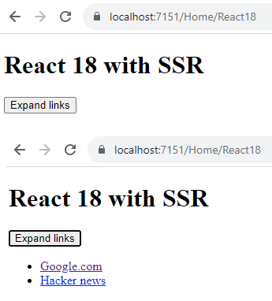
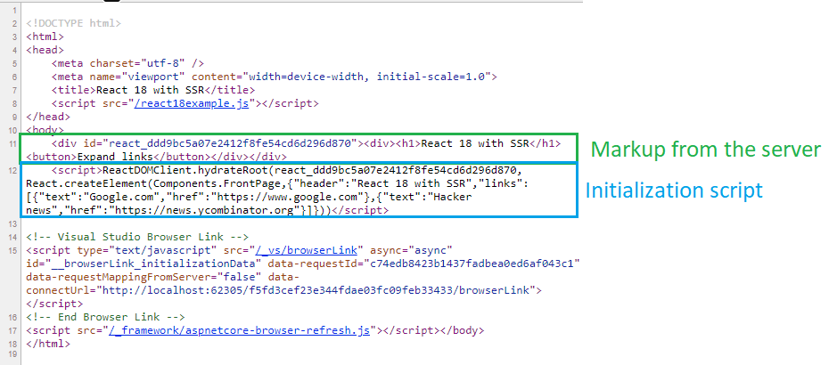
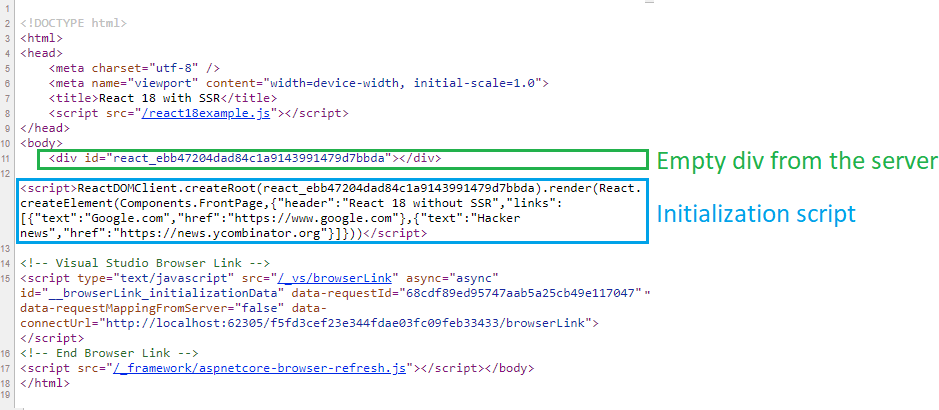


SSR.Net
============

SSR.Net enables you to Server Side Render (SSR) components in React 17, React 18 and Vue 3 in .Net Framework/Core/5/6/7. It is open for extension and can support other frontend frameworks. It aims at being a performant, minimalistic way to support SSR in .Net. 

It is based on many of the ideas in ReactJS.Net: https://github.com/reactjs/React.NET.

**Table of Contents**

[TOC]

## Installation
This library can be installed through NuGet. You will also need to install a JavaScriptEngineSwitcher engine and native engine libraries according to your environment. 

## Configuration and usage

The easiest way to get started is to copy or look at one of the example projects:
* For .Net Framework: https://github.com/knowit/SSR.Net/tree/main/src/SSR.Net.DotNetFramework
* For .Net 6: https://github.com/knowit/SSR.Net/tree/main/src/SSR.Net.DotNet6
* Example frontend for React 18: https://github.com/knowit/SSR.Net/tree/main/src/Frontend/React18Source
* Example frontend for React 17: https://github.com/knowit/SSR.Net/tree/main/src/Frontend/React17Source
* Example frontend for Vue 3: https://github.com/knowit/SSR.Net/tree/main/src/Frontend/Vue3Source

To build frontend, just run the build scripts in package.json.

To configure and use SSR.Net, you need to do several things:
* [Build a JavaScript bundle fit for SSR](#Building-a-JavaScript-bundle-fit-for-SSR)
* [Set up a web project](#set-up-a-web-project)
* [Set up a controller and a view](#Set-up-a-controller-and-a-view)

We will look at how to do this for React 18 and .Net 6 in the following chapters. There are examples for React 17, React 18 and Vue 3 for both .Net Framework and .Net 6 in the code base. The examples in .Net 6 should be quite descriptive for .Net Core 2 and forward.

### Building a JavaScript bundle fit for SSR

We start by creating a bundle with some components. For React 18, there is an example here: https://github.com/knowit/SSR.Net/tree/main/src/Frontend/React18Source

We will create a FrontPage component for this example (source code here: https://github.com/knowit/SSR.Net/blob/main/src/Frontend/React18Source/src/Components/FrontPage.tsx). 

```
import React, { useState } from "react";

interface Link {
  text: string;
  href: string;
}

interface Props {
  header?: string;
  links?: Link[];
}

const FrontPage = ({ header, links }: Props) => {
  const [expanded, setExpanded] = useState(false);
  return (
    <div>
      <h1>{header}</h1>
      {links && (
        <>
          <button onClick={() => setExpanded(!expanded)}>Expand links</button>
          {expanded && (
            <ul>
              {links.map((link, idx) => (
                <li key={idx}>
                  <a href={link.href}>{link.text}</a>
                </li>
              ))}
            </ul>
          )}
        </>
      )}
    </div>
  );
};

export default FrontPage;

```

This component has a simple expand/collapse function. This will show us that React is actually working interactively on the client side.

We then create an entry point for our bundle. Here, we expose the React, ReactDOMServer and ReactDOMClient libraries as global variables. We also expose the components we've created. It works well to just import them all and add them to a global Components variable. See an example of how this is done here:
https://github.com/knowit/SSR.Net/blob/main/src/Frontend/React18Source/src/app.tsx

```
import * as React from 'react'
import * as ReactDOMServer from 'react-dom/server'
import * as ReactDOMClient from 'react-dom/client'
import FrontPage from './Components/FrontPage'
import ArticlePage from './Components/ArticlePage'

globalThis.React = React;
globalThis.ReactDOMServer = ReactDOMServer;
globalThis.ReactDOMClient = ReactDOMClient;
globalThis.Components = {FrontPage, ArticlePage};
```

In this simple example we use esbuild alone to build the bundle, but it's no problem to use Webpack. You can also use Vite, but you will need to turn off the built in minification and find a different way of minifying it, otherwise the global variables will be removed from the bundle during tree shaking. The esbuild command we use is in the package.json (https://github.com/knowit/SSR.Net/blob/main/src/Frontend/React18Source/package.json):

```
  "scripts": {
...
    "build-dotnet6": "esbuild ./src/app.tsx --bundle --outfile=../../SSR.Net.DotNet6/wwwroot/react18example.js"
  },
```

We run this through npm:

```
npm run build-dotnet6
```

The resulting js bundle is build to the wwwroot folder in the DotNet6 project as react18example.js: https://github.com/knowit/SSR.Net/tree/main/src/SSR.Net.DotNet6/wwwroot

### Set up a web project

Let's look at this example web project: https://github.com/knowit/SSR.Net/tree/main/src/SSR.Net.DotNet6

We have an extension method for adding a React18Renderer to IoC, which is the normal way of adding things to .Net Core and forward:
https://github.com/knowit/SSR.Net/blob/main/src/SSR.Net.DotNet6/Services/ServiceCollectionExtensionsReact18SSR.cs

```
using JavaScriptEngineSwitcher.V8;
using SSR.Net.Services;

namespace SSR.Net.DotNet6.Services
{
    public static class ServiceCollectionExtensionsReact18SSR
    {
        public static void AddReact18Renderer(this IServiceCollection services, IWebHostEnvironment webHostEnvironment)
        {
            var pool = new JavaScriptEnginePool(new V8JsEngineFactory(), config =>
                config
                    .AddScriptFile(Path.Combine(webHostEnvironment.WebRootPath, "React18TextEncoderPolyfill.js"))
                    .AddScriptFile(Path.Combine(webHostEnvironment.WebRootPath, "react18example.js"))
            );
            services.AddSingleton(new React18Renderer(pool));
        }
    }
}
```

The code above adds both a server side polyfill named React18TextEncoderPolyfill.js (React 18 needs this, and it's missing in the Java Script Engine), and the bundle we created in [Building a JavaScript bundle fit for SSR](#Building-a-JavaScript-bundle-fit-for-SSR), react18example.js. These script files will be run on each server side JavaScript engine during initialization. This means that each JavaScript engine on the server side will be able to run React, ReactDOMServer, ReactDOMClient and access our FrontPage component through the global variable Components.

We use the V8 JavaScript engine in this example. This, and the scripts, is configured in a JavaScriptEnginePool. This pool will manage JavaScript engines, create new ones proactively, dispose exhausted engines and be a broker for the actual rendering commands. 

To make this work, we have to reference some packages in our web project:
https://github.com/knowit/SSR.Net/blob/main/src/SSR.Net.DotNet6/SSR.Net.DotNet6.csproj

``` 
    <PackageReference Include="JavaScriptEngineSwitcher.Core" Version="3.19.0" />
    <PackageReference Include="JavaScriptEngineSwitcher.V8" Version="3.20.10" />
    <PackageReference Include="Microsoft.ClearScript.Core" Version="7.3.7" />
    <PackageReference Include="Microsoft.ClearScript.V8.Native.win-x64" Version="7.3.7" />
    <PackageReference Include="Microsoft.ClearScript.V8.Native.win-x86" Version="7.3.7" />
```

After this is done, we call the extension method during the initialization of our program in Program.cs: https://github.com/knowit/SSR.Net/blob/main/src/SSR.Net.DotNet6/Program.cs

```
builder.Services.AddReact18Renderer(builder.Environment);
```


### Set up a controller and a view

To do the actual Server Side Rendering, we need to serialize props for the React component we want to Server Side Render and send the props as JSON to the React18Renderer, together with the component name. In this simplified example, we do this directly in the controller (https://github.com/knowit/SSR.Net/blob/main/src/SSR.Net.DotNet6/Controllers/HomeController.cs). 

First, we inject the React18Renderer in the controller (some lines are removed for brevity and clarity):

```
    public class HomeController : Controller {
        private readonly React18Renderer _react18Renderer;

        public HomeController(React18Renderer react18Renderer)
        {
            _react18Renderer = react18Renderer;
        }
	...
	}
```

Then we add an action to the controller, where we serialize our model and let the React18Renderer create both the HTML and the initialization script. These are returned as a RenderedComponent from the React18Renderer, and passed on to the view:

```
public ActionResult React18() {
    var propsJson = JsonConvert.SerializeObject(
        new {
            header = "React 18 with SSR",
            links = new[]{
                new {
                    text = "Google.com",
                    href = "https://www.google.com"
                },
                new {
                    text = "Hacker news",
                    href = "https://news.ycombinator.org"
                }
            }
        });
    var renderedComponent = _react18Renderer.RenderComponent("Components.FrontPage", propsJson);
    return View(renderedComponent);
}
```

The view is kept very simple (https://github.com/knowit/SSR.Net/blob/main/src/SSR.Net.DotNet6/Views/Home/React18.cshtml):

```
@using SSR.Net.Models;
@model RenderedComponent
@{
    Layout = null;
}

<!DOCTYPE html>
<html>
<head>
    <meta charset="utf-8" />
    <meta name="viewport" content="width=device-width, initial-scale=1.0">
    <title>React 18 with SSR</title>
    <script src="~/react18example.js"></script>
</head>
<body>
    @Html.Raw(Model.Html)
    <script>@Html.Raw(Model.InitScript)</script>
</body>
</html>
```

Here we use RenderedComponent as our model. We set Layout to null, because we only use the markup in this file. We include the react18example.js script that we created in [Building a JavaScript bundle fit for SSR](#Building-a-JavaScript-bundle-fit-for-SSR) in a <script> tag in the <head> tag. 

Inside the <body> tag, there are just two lines. The first one takes the HTML from our RenderedComponent and renders it as a raw string in the view. The second one takes the initialization script and renders it as a raw string inside a <script> tag. 

## Running the solution

When running the solution and visiting the React 18 view, we see that it's working and that we can interact with it (clicking Expand links will expand the links):



If we view the source, we see that we get markup from the server and not just an empty <div>.  We also see the initialization script, which instructs React to latch on to the DOM in the <div> with the markup by calling ReactDOMClient.hydrateRoot:



If the rendering was done without SSR, then the div would be empty and the initialization script would call ReactDOMClient.createRoot:



## Performance and scaling
In order to be ready to render components quickly, SSR.Net ensures that a configurable number of JavaScript engines are initialized with a given JavaScript bundle. This is done when instantiating a new JavaScriptEnginePool. There are several thresholds controlling this:
* Minimum engines: When starting or reconfiguring SSR.Net, it will make sure there are at least this number of engines in the engine pool.
* Maximum engines: The number of engines in the engine pool will never exceed this threshold.
* Standby engines: The number of unoccupied (spare) engines in the pool. 
* Maximum engine usages: A given engine can be used this number of times before it gets disposed of.

There are methods to configure this when initializing the JavaScriptEnginePool:

```
            var pool = new JavaScriptEnginePool(new V8JsEngineFactory(), config =>
                config
                    .AddScriptFile(Path.Combine(webHostEnvironment.WebRootPath, "React18TextEncoderPolyfill.js"))
                    .AddScriptFile(Path.Combine(webHostEnvironment.WebRootPath, "react18example.js"))
                    .WithMinEngineCount(5)
                    .WithStandbyEngineCount(3)
                    .WithMaxEngineCount(25)
                    .WithMaxUsagesCount(100)
            );
            services.AddSingleton(new React18Renderer(pool));
```

Example:

Let's say we have configured a minimum of 5 engines, a maximum of 25 engines and 3 engines on standby. Before any requests come in, there will be 5 vacant engines. 
Then 3 requests come in at the same time, occupying 3 engines. SSR.Net will see that there are only 2 engines on standby, and will initialize another engine to comply with the "3 engines on standby" requirement. 

Traffic increases drastically, and at some point 23 engines are occupied concurrently. SSR.Net will ensure that there are 25 engines initialized, but will not exceed this threshold, to comply with the "maximum of 25 engines" requirement.

Then, there are only 2-3 concurrent requests for a long time. The engines will eventually be exhausted and disposed of, and the number of engines declines. At some point, there are only 5 engines left. The next time an engine gets exhausted, SSR.Net will dispose of it and see that there are only 4 engines left. Then SSR.Net will initialize a new engine to comply with the "minimum of 5 engines" requirement.

## Limitations and workarounds when doing SSR
* The window object does not exist. This means that your code needs to check if window is defined before using it:
```
if (typeof window !== 'undefined')
{
//Do stuff with window here
}
```
* Global variables must not be used (except the ones described above for exposing objects to SSR.Net). Each JavaScript Engine is used multiple times, so global variables will cause state to be shared between requests, meaning data can leak from one user to another.
* Some 3rd party packages may fail, if they use the window object or global variables.
* SSR in React won't run useEffect hooks. So using the window object in a useEffect is safe. Also, if you have code that requires the window object and that doesn't contain markup that you need served from the server side, then you can defer including it to after the first contentful paint:

```
const [initialized, setInitialized] = useState(false);

useEffect(()=>setInitialized(true));

return (<div>{initialized && <ComponentThatDoesNotSupportSSR {...someProps} />}</div>);
```

